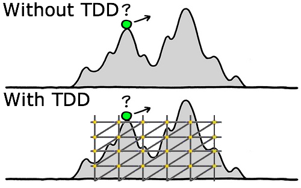
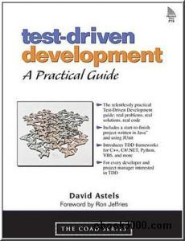
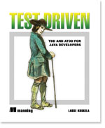

% Test-driven Development
% a gentle intro
% Session 2

# What is TDD?
> - an iterative development technique
> - it focuses on simple design
> - leverage unit-testing

# Why TDD?
> - Improves software (less bugs)
> - Speeds up development (more productivity)
> - Flexible and extensible software (code quality)
> - Better documentation

# The Mantra
- Take baby steps
- Write unit-tests before the implementation
- Apply refactorings

# The reality
- Write some high level test
- Write code for several things
- Test and debug
- Test and debug
- Test and debug
- Add TODO for refactor
 
-------------------------

# Let’s break it down

# THINK
Focus on the behaviour you wish for the code

# RED
- Write a test, **watch it fail!**
- Behaviour == API

# GREEN
- Write the code, **make it pass!**

> - *Fake it, until you make it!*
> - Triangulation
> - Obvious implementation

# REFACTOR
- Simplify design
- Do **NOT** modify behaviour!

# Yes, but why?

# Limitations
> - Steep learning curve
> - It requires discipline
> - Hard for UI development
> - Laborious for legacy code

# References

