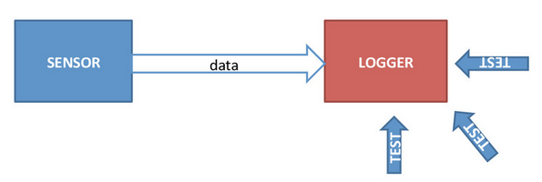
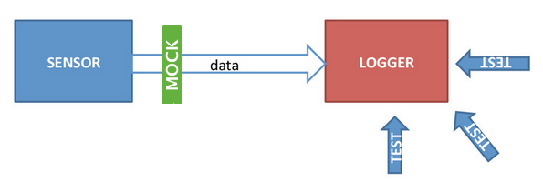

% Testing using Mocks
% Session 4

# Remember the SOLID principles?
> - Make your code testable

# Testability
> Degree to which a system or component facilitates the
establishment of a test criteria and the performance of tests to  determine whether those criteria have been met.  
(IEEE 610.12)

-----------------------

### To achieve testability you need:
- *Controllability*: control the inputs 
- *Observability*: check the outputs

-----------------------

### In reality:
- a component is depends on *another system*
- Controllability is difficult!

# The curse of dependencies:
- hard to observe
- difficult to setup
- slow
- tighten to the UI
- not existing

# Remember what is **not** unit-testing?

# Introducing mock objects
Fake the implementation of objects that are hard to control, so you can observe them

# Mock object
- Check method calls
- Check arguments
- Test interaction with *your* system 

# Example

- *Sensor* is a hardware for temperature sensing
- It sends data to *Logger*
- Testing *Logger* is cumbersome

------------------------------

Mock out *Sensor* with an object that behaves like it!

# Mock lifecycle
- Create 
- Set expectations
- Put in ready state
- Verify expectation

# How many mocks?
> - One concrete class, mock the rest
> - Law of Demeter aka *“Only talk to your friends”*

# Demo
#### Let’s implement a Stocks portfolio
- You can add stocks to your portfolio
- You can ask for the total value of your portfolio
- The value of your stocks is given by a **market** 
- The market service is an **external** dependence
- Let’s mock the market service
